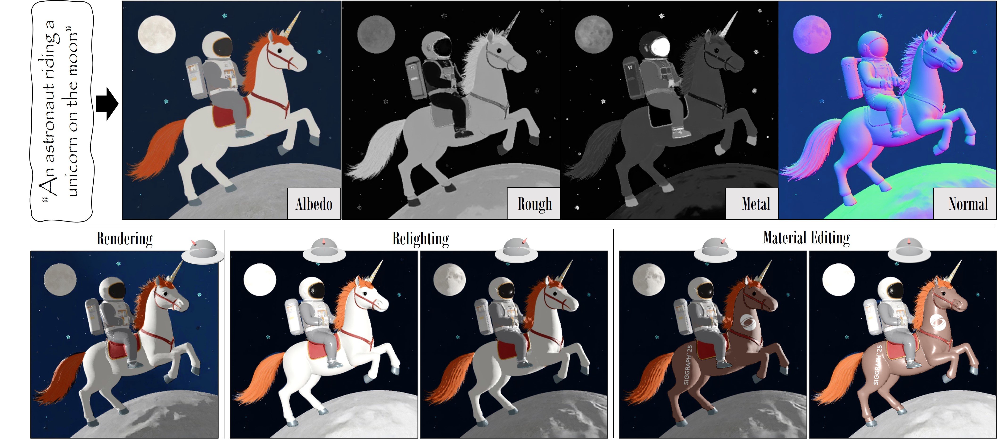

<p align="center">

  <h1 align="center">IntrinsiX: High-Quality PBR Generation using Image Priors</h1>
  <p align="center">
    <a href="https://peter-kocsis.github.io/">Peter Kocsis</a>
    ·
    <a href="https://lukashoel.github.io/">Lukas Höllein</a>
    ·
    <a href="https://niessnerlab.org/members/matthias_niessner/profile.html">Matthias Nießner</a>
  </p>
  <h2 align="center">NeurIPS 2025</h2>
  <h3 align="center"><a href="https://arxiv.org/abs/2504.01008">Paper</a> | <a href="https://peter-kocsis.github.io/IntrinsiX/">Project Page</a> </h3>
  <div align="center"></div>
</p>

<p align="center">
  <a href="">
    
  </a>
</p>

<p align="center">
Recent generative models directly create shaded images, without any explicit material and shading representation. From text input, we generate renderable PBR maps. We first train separate LoRA modules for the intrinsic properties of albedo, rough/metal, normal. Then, we introduce cross-intrinsic attention using a rerendering loss with importance-weighted light sampling to enable coherent PBR generation. Next to editable image generation, our predictions can be distilled into room-scale scenes using SDS for large-scale PBR texture generation. 
</p>
<br>

## Structure
Our project has the following structure:

```
├── docs                  <- Project page
├── data                  <- Datasets
├── configs               <- Training configs
├── intrinsix             <- Our main package for IntrinsiX
├── scene_intrinsix       <- SceneIntrinsiX - Code for room-scale texturing
├── models                <- Model and config folder
├── outputs               <- Training outputs
├── environment.yaml      <- Env file for creating conda environment
├── LICENSE
└── README.md
```

# Installation
To install the dependencies, you can use the provided environment file:
```
conda create -f environment.yaml
conda activate intrinsix
```

### Model
IntrinsiX can be downloaded from [HuggingFace](https://huggingface.co/PeterKocsis/IntrinsiX). The weights will be automatically downloaded to the models folder during running our provided scripts. 

# Training
To train our model, first, the dataset and the pre-trained model needs to be prepared.

## Dataset
```
...
├── data                   <- Datasets
│   ├── InteriorVerseSmall   <- Small subset of InteriorVerse used for albedo an normal training
│   ├── InteriorVerseCaption <- Captions for the InteriorVerse dataset
│   ├── InteriorVerse        <- InteriorVerse dataset used for rough and metal training
│   │   └── dataset_85         <- 85FOV dataset
│   │        ├── train.txt        <- List of training scenes
│   │        ├── val.txt          <- List of validation scenes
│   │        ├── test.txt         <- List of test scenes
│   │        ├── L3D197S21ENDIMKITJAUI5NYALUF3P3XC888      
│   │        └── ...
...
```
Our model has been trained on the 85 FOV images of the [InteriorVerse](https://interiorverse.github.io/#download) synthetic indoor dataset. Please refer to the official instructions to download the dataset. 
You can download our pre-generated captions:
```
mkdir data
wget "https://kaldir.vc.cit.tum.de/intrinsix/InteriorVerseCaption.zip" -O "data/InteriorVerseCaption.zip"
unzip "data/InteriorVerseCaption.zip" -d data
rm data/InteriorVerseCaption.zip
```
We use a small subset of the dataset for our albedo and normal map trainings, which can be found under the `data/InteriorVerseSmall` folder. Before using it, the InteriorVerse terms of use must be accepted. You can download them with the following commands:
```
mkdir data
wget "https://kaldir.vc.cit.tum.de/intrinsix/InteriorVerseSmall.zip" -O "data/InteriorVerseSmall.zip"
unzip "data/InteriorVerseSmall.zip" -d data
rm data/InteriorVerseSmall.zip
```

## Pre-trained Model
Our method fine-tunes the pre-trained FLUX.1-dev model. Use the following command to get the pre-trained model, which will be automatically downloaded to the `models` folder at the first run.

## Train
Our method is trained in two stages. We provide separate scripts for the stages and config files in `configs/train`. 

### 1. Independent Intrinsic Generator
In the first stage, we train separate LoRA modules, which enable independent intrinsic image generation. This training uses around 47GB VRAM and takes around 6.5 hours on a single Nvidia RTX_A6000, or 4 hours on a single Nvidia A100. 
``` 
accelerate launch intrinsix/train_independent.py independent_albedo.yaml
accelerate launch intrinsix/train_independent.py independent_material.yaml
accelerate launch intrinsix/train_independent.py independent_normal.yaml
```

### 2. Cross-Intrinsic Alignment
In the second stage, we align the trained independent intrinsic LoRA modules. This training uses around 80GB VRAM and takes around 44 hours on a single Nvidia A100. Similarly as observed during ControlNet training, the model will suddenly converge after 1500 steps. 
``` 
python -m intrinsix.train_alignment alignment.yaml
```

# Inference
We provide a gradio demo, which allows sampling our model and rendering the intrinsic channels. Sampling the model requires at least 35GB VRAM, has been tested on Nvidia RTX_A6000. 
``` 
python -m intrinsix
```

After starting the demo and generating the default text prompt (astronaut on unicorn), you should get the following results:


# Room-Scale Texturing
Texturing code is planned to be released at the end of November. 

# Acknowledgements
This project is built upon the [diffusers](https://huggingface.co/docs/diffusers/en/index) implmenentation of [FLUX](https://github.com/black-forest-labs/flux). 
Our demo uses [Gradio](https://www.gradio.app/).
Our model was trained on a subset of the high-quality [InteriorVerse](https://interiorverse.github.io/) synthetic indoor dataset. 
Rendering model was inspired by [Zhu et. al. 2022](https://github.com/jingsenzhu/IndoorInverseRendering). 

# Citation
If you find our code or paper useful, please cite as
```bibtex
@article{kocsis2025intrinsix,
  author    = {Kocsis, Peter and H\"{o}llein, Lukas and Nie\{ss}ner, Matthias},
  title     = {IntrinsiX: High-Quality PBR Generation using Image Priors},
  journal   = {Advances in Neural Information Processing Systems (NeurIPS)},
  year      = {2025},
}
```
