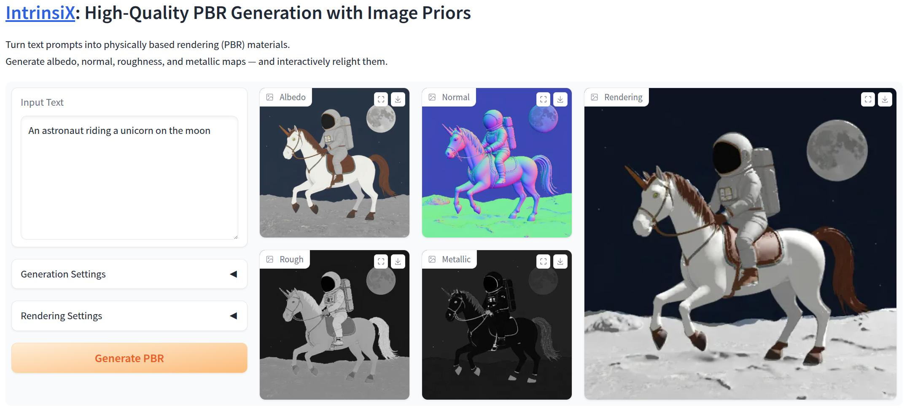

<p align="center">

  <h1 align="center">IntrinsiX: High-Quality PBR Generation using Image Priors</h1>
  <p align="center">
    <a href="https://peter-kocsis.github.io/">Peter Kocsis</a>
    ·
    <a href="https://lukashoel.github.io/">Lukas Höllein</a>
    ·
    <a href="https://niessnerlab.org/members/matthias_niessner/profile.html">Matthias Nießner</a>
  </p>
  <h2 align="center">NeurIPS 2025</h2>
  <h3 align="center"><a href="https://arxiv.org/abs/2504.01008">Paper</a> | <a href="https://peter-kocsis.github.io/IntrinsiX/">Project Page</a> </h3>
  <div align="center"></div>
</p>

<p align="center">
  <a href="">
    <video autoplay="" muted="" loop="" width="80%" height="auto" style="pointer-events: none;">
            <source src="./docs/static/teaser/teaser.av1.mp4" type="video/mp4">
        </video>
  </a>
</p>

<p align="center">
Recent generative models directly create shaded images, without any explicit material and shading representation. From text input, we generate renderable PBR maps. We first train separate LoRA modules for the intrinsic properties of albedo, rough/metal, normal. Then, we introduce cross-intrinsic attention using a rerendering loss with importance-weighted light sampling to enable coherent PBR generation. Next to editable image generation, our predictions can be distilled into room-scale scenes using SDS for large-scale PBR texture generation. 
</p>
<br>

## Structure
Our project has the following structure:

```
├── docs                  <- Project page
├── intrinsix             <- Our main package for IntrinsiX
├── models                <- Model and config folder
├── environment.yaml      <- Env file for creating conda environment
├── LICENSE
└── README.md
```

# Installation
To install the dependencies, you can use the provided environment file:
```
conda create -f environment.yaml
conda activate intrinsix
```

### Model
IntrinsiX can be downloaded from [HuggingFace](https://huggingface.co/PeterKocsis/IntrinsiX). The weights will be automatically downloaded to the models folder during running our provided scripts. 

# Training
Training code is planned to be released at the end of November. 

# Inference
We provide a gradio demo, which allows sampling our model and rendering the intrinsic channels. Sampling the model requires at least 35GB VRAM, has been tested on Nvidia RTX_A6000. 
``` 
python -m intrinsix
```

After starting the demo and generating the default text prompt (astronaut on unicorn), you should get the following results:


# Room-Scale Texturing
Texturing code is planned to be released at the end of November. 

# Acknowledgements
This project is built upon the [diffusers](https://huggingface.co/docs/diffusers/en/index) implmenentation of [FLUX](https://github.com/black-forest-labs/flux). 
Our demo uses [Gradio](https://www.gradio.app/).
Our model was trained on a subset of the high-quality [InteriorVerse](https://interiorverse.github.io/) synthetic indoor dataset. 
Rendering model was inspired by [Zhu et. al. 2022](https://github.com/jingsenzhu/IndoorInverseRendering). 

# Citation
If you find our code or paper useful, please cite as
```bibtex
@article{kocsis2025intrinsix,
  author    = {Kocsis, Peter and H\"{o}llein, Lukas and Nie\{ss}ner, Matthias},
  title     = {IntrinsiX: High-Quality PBR Generation using Image Priors},
  journal   = {Advances in Neural Information Processing Systems (NeurIPS)},
  year      = {2025},
}
```
